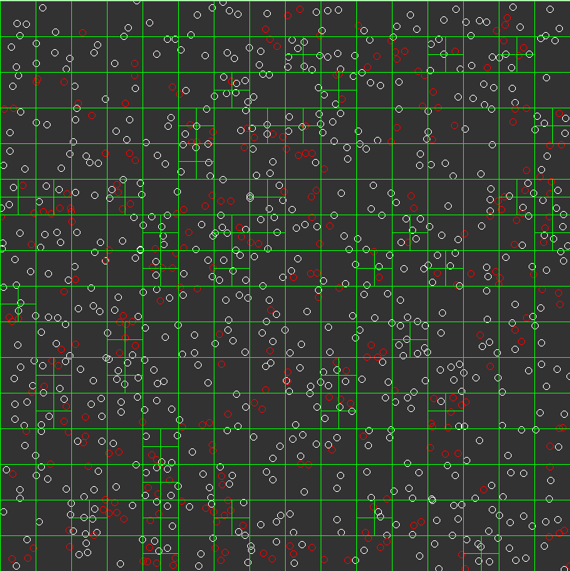

# Quadtree-Collision-Detection-Visualization
The purpose of this project is to apply quadtree data structure to collision detection logic and observe how it impacts performance depending on various parameters.

